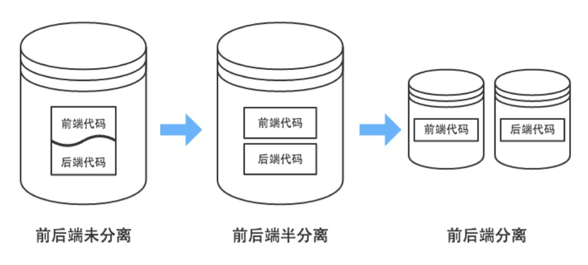
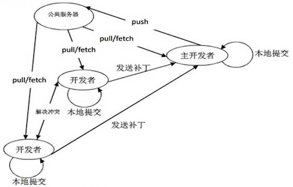

## 一、项目概览

Swiper Social 是一个类似于 “探探” 的社交类程序, 采用前后端分离结构, 主要包含以下模块：

1. 个人模块
2. 社交模块
3. VIP 模块
4. 异步任务模块
5. Redis 缓存模块
6. 日志模块、异常处理模块
7. 短信模块、邮件模块
8. 运维、部署
9. 前端模块
10. 其他

项目阶段时间规划：

1. Web 5 ~ 7 天
2. Python 进阶、爬虫、数据 3 ~ 5 天


## 二、项目目标

1. 了解真实项目的开发流程
2. 掌握如何使用 Git 完成协作开发和代码管理
3. 掌握 RESTful 的概念, 掌握前后端分离式的开发
4. 掌握日志的使用
5. 掌握缓存的使用
6. 掌握 Redis 不同数据类型的用法
7. 掌握 Celery 异步任务处理
8. 掌握 Nginx 的配置, 及负载均衡的原理
9. 了解分布式数据库及数据分片
10. 掌握数据库关系建模, 及不使用外键如何构建关系
11. 掌握服务器异常处理, 及报警处理
12. 熟练掌握常用 Linux 命令, 以及初级 bash 脚本的开发
13. 掌握线上服务器的安装、部署
14. 理解进程、线程、协程的原理, 以及多路复用、事件驱动、异步非阻塞等概念
15. 对服务器架构、服务高可用等有一个初步认识


## 三、项目布局

- 概览

    ```
    proj/
    ├── proj/
    │   ├── settings.py
    │   ├── other_config.py  # 其他配置
    │   ├── urls.py
    │   └── wsgi.py
    ├── common/              # 不与具体模块关联的独立的东西写到这里
    │   ├── errors.py
    │   ├── keys.py
    │   └── middleware.py
    ├── app1/
    │   ├── migrations/
    │   ├── apps.py
    │   ├── helper.py        # 逻辑写到这里
    │   ├── models.py
    │   └── views.py (api.py)
    ├── app2/
    │   ├── migrations/
    │   ├── apps.py
    │   ├── helper.py
    │   ├── models.py
    │   └── views.py (api.py)
    ├── lib/                 # 底层模块写到这里
    │   ├── cache.py
    │   ├── http.py
    │   ├── orm.py
    │   └── sms.py
    ├── worker/              # 异步任务
    │   ├── __init__.py
    │   └── config.py
    └── manage.py
    ```

- 通用的算法、功能放到 common 目录
- 底层的功能放到 lib 目录
- 独立脚本的放到 scripts 目录
- 配置文件放到项目目录 或 config 目录
- views.py 及 view_func()
    1. MVC 模式的 V 只负责试图处理, 逻辑属于 Controller 层
    2. view_func 本身不适合写逻辑, view 是特殊函数, 只负责视图处理。
    3. 添加 helper.py 文件, 用来放置每个 app 的逻辑函数
    4. 函数构建应保持功能单一, 一个函数只做一件事情, 并把它做好, 避免构建复杂函数
    5. 复杂功能通过不同函数组合完成

## 四、RESTful 与 前后端分离

1. RESTful
    - RESTful 是一种网络软件架构风格, 而非标准
    - 用 URL 定位一个网络资源
    - 用 HTTP 动词描述对资源的操作
        - GET: 用来获取资源
        - POST: 用来新建资源
        - PUT: 用来更新资源
        - DELETE: 用来删除资源
    - 误区
        - URL 中使用动词
        - URL 中出现版本号
        - 参数用 querystring 表示, 而不要拼在 path 部分
            - 错误示范: GET /user/book/3
            - 正确示范: GET /user/book?id=3
        - 状态码的使用要精确
            - 2xx：操作成功
            - 3xx：重定向
            - 4xx：客户端错误
            - 5xx：服务器错误
    - RESTful 与 Django REST framework 的区别

2. 前后端分离

    传统 Web 开发, view 函数中需要进行墨般渲染, 逻辑处理与显示的样式均需要后端开发。

    变成前后端分离后, 显示效果的处理完全交给前端来做, 前端自由度变大。后端只需要传递前端需要的数据即可, 将后端人员从繁琐的显示处理中解放出来, 专心处理业务逻辑

    - 优点: 前端负责显示, 后端负责逻辑, 分工更加明确, 彻底解放前、后端开发者
    - JSON: 完全独立于编程语言的文本格式, 用来存储和表示数据

    - 前后端分离的本质

      

    - 前后端分离后的开发流程

      

3. 代码实现

    ```python
    from json import dumps

    from django.http import HttpResponse

    def render_json(data=None, error_code=0):
        '''将返回值渲染为 JSON 数据'''
        result = {
            'data': data,       # 返回给前端的数据
            'code': error_code  # 状态码 (status code)
        }

        json_str = dumps(result, ensure_ascii=False, separators=[',', ':'])
        return HttpResponse(json_str)
    ```

4. 接口的定义

    1. 定义接口基本格式

       ```json
       {
           "code": 0,   // 状态码 (status code)
           "data": {    // 接口数据
               "user": {
                   "uid": 123321,
                   "username": "Lion",
                   "age": 21,
                   "sex": "Male"
                },
               "date": "2018-09-12",
           }
       }
       ```

    2. 定义 status 状态码

        code | description
        -----|-------------
        0    | 正常
        1000 | 服务器内部错误
        1001 | 参数错误
        1002 | 数据错误

    3. 详细定义每一个接口的各个部分:
        - 名称 (Name)
        - 描述 (Description)
        - 方法 (Method)
        - 路径 (Path)
        - 参数 (Params)
        - 返回值 (Returns)

    4. 接口定义举例：

        > **接口名称：提交验证码登录**
        >
        > * **Description**: 根据上一步的结果提交需要的数据
        > * **Method**: POST
        > * **Path**: /user/login
        > * **Params**:
        >
        >    field | required | type | description
        >    ------|----------|------|-----------------------
        >    phone | Yes      |  int | 手机号
        >     code | Yes      |  int | 验证码
        >
        > * **Return**:
        >
        >    field     | required | type | description
        >    ----------|----------|------|-----------------------
        >     uid      |    Yes   | int  | 用户 id
        >     nickname |    Yes   | str  | 用户名
        >     age      |    Yes   | int  | 年龄
        >     sex      |    Yes   | str  | 性别
        >     location |    Yes   | str  | 常居地
        >     avatars  |    Yes   | list | 头像 URL 列表, 最多为 6 张
        >
        >    示例:
        >    ```json
        >    {
        >        "code": 0,
        >        "data": {
        >            "uid": 123,                   // 用户 id
        >            "nickname": "Miao",           // 用户名
        >            "age": 21,                    // 年龄
        >            "sex": "M",                   // 性别
        >            "location": "China/Beijing",  // 常居地
        >            "avatars": [                  // 头像 URL 列表, 最多为 6 张
        >                "http://xxx.com/user/avatar/123/1.jpg",
        >                "http://xxx.com/user/avatar/123/2.jpg",
        >                "http://xxx.com/user/avatar/123/3.jpg",
        >                ...
        >            ]
        >        },
        >    }
        >    ```

## 五、日志处理

1. 日志的作用

    程序部署到服务器后会以 Daemon 方式长期运行, 没有办法直接看到程序的运行状况, 所以会将程序运行中的状况以日志的形式输出到文件中, 即“日志文件”

    Python 已经提供了日志模块 logging, 可以直接使用。Django 使用的日志系统也是 Python 原生的 logging

2. 基本用法

    ```python
    import logging

    # 设置日志格式
    fmt = ('%(asctime)s %(levelname)7.7s %(funcName)s: %(message)s')
    formatter = logging.Formatter(fmt, datefmt="%Y-%m-%d %H:%M:%S")

    # 设置 handler
    handler = logging.handlers.TimedRotatingFileHandler('myapp.log', when='D', backupCount=30)
    handler.setFormatter(formatter)

    # 定义 logger 对象
    logger = logging.getLogger("MyApp")
    logger.addHandler(handler)
    logger.setLevel(logging.INFO)
    ```

3. 日志的等级

    * DEBUG: 调试信息
    * INFO: 普通信息
    * WARNING: 警告
    * ERROR: 错误
    * FATAL: 致命错误

4. 对应函数

    * `logger.debug(msg)`
    * `logger.info(msg)`
    * `logger.warning(msg)`
    * `logger.error(msg)`
    * `logger.fatal(msg)`

5. 日志格式允许的字段

    * `%(name)s` : Logger的名字
    * `%(levelno)s` : 数字形式的日志级别
    * `%(levelname)s` : 文本形式的日志级别
    * `%(pathname)s` : 调用日志输出函数的模块的完整路径名, 可能没有
    * `%(filename)s` : 调用日志输出函数的模块的文件名
    * `%(module)s` : 调用日志输出函数的模块名
    * `%(funcName)s` : 调用日志输出函数的函数名
    * `%(lineno)d` : 调用日志输出函数的语句所在的代码行
    * `%(created)f` : 当前时间, 用UNIX标准的表示时间的浮点数表示
    * `%(relativeCreated)d` : 输出日志信息时的, 自Logger创建以来的毫秒数
    * `%(asctime)s` : 字符串形式的当前时间。默认格式是“2003-07-08 16:49:45,896”。逗号后面的是毫秒
    * `%(thread)d` : 线程ID。可能没有
    * `%(threadName)s` : 线程名。可能没有
    * `%(process)d` : 进程ID。可能没有
    * `%(message)s` : 用户输出的消息

6. Django 中的日志配置

    ```python
    LOGGING = {
        'version': 1,
        'disable_existing_loggers': True,
        # 格式配置
        'formatters': {
            'simple': {
                'format': '%(asctime)s %(module)s.%(funcName)s: %(message)s',
                'datefmt': '%Y-%m-%d %H:%M:%S',
            },
            'verbose': {
                'format': ('%(asctime)s %(levelname)s [%(process)d-%(threadName)s] '
                        '%(module)s.%(funcName)s line %(lineno)d: %(message)s'),
                'datefmt': '%Y-%m-%d %H:%M:%S',
            }
        },
        # Handler 配置
        'handlers': {
            'console': {
                'class': 'logging.StreamHandler',
                'level': 'DEBUG' if DEBUG else 'WARNING'
            },
            'info': {
                'class': 'logging.handlers.TimedRotatingFileHandler',
                'filename': f'{BASE_DIR}/logs/info.log',  # 日志保存路径
                'when': 'D',        # 每天切割日志
                'backupCount': 30,  # 日志保留 30 天
                'formatter': 'simple',
                'level': 'INFO',
            },
            'error': {
                'class': 'logging.handlers.TimedRotatingFileHandler',
                'filename': f'{BASE_DIR}/logs/error.log',  # 日志保存路径
                'when': 'W0',      # 每周一切割日志
                'backupCount': 4,  # 日志保留 4 周
                'formatter': 'verbose',
                'level': 'WARNING',
            }
        },
        # Logger 配置
        'loggers': {
            'django': {
                'handlers': ['console'],
            },
            'inf': {
                'handlers': ['info'],
                'propagate': True,
                'level': 'INFO',
            },
            'err': {
                'handlers': ['error'],
                'propagate': True,
                'level': 'WARNING',
            }
        }
    }
    ```

## 六、状态码及异常处理

1. 为什么要定义错误码
    * 使用错误码可以将错误分类, 调试时更容易甄别错误
    * 前后端通过错误码识别错误, 使接口更简单
    * 前端处理多语言时, 可以使用错误码匹配不同语言的提示信息

2. 逻辑异常类的实现

    ```python
    class LogicError(BaseException):
        '''程序内部逻辑错误'''
        code = None

        def __init__(self, data=None):
            self.data = data  # 发生异常时需要传回前端的数据

        def __str__(self):
            return self.__class__.__name__

    def gen_error(name: str, err_code: int) -> LogicError:
        '''逻辑异常类的工厂函数'''
        base_cls = (LogicError,)
        cls_attr = {'code': err_code}
        return type(name, base_cls, cls_attr)

    # 定义逻辑异常
    InternalError = gen_error('InternalError', 1000)  # 服务器内部错误
    LoginRequired = gen_error('LoginRequired', 2000)  # 用户未登录
    ```

3. 逻辑异常处理中间件

    ```python
    from django.utils.deprecation import MiddlewareMixin

    from common import errors
    from lib.http import render_json

    class ErrorHandlerMiddleware(MiddlewareMixin):
        '''将结果渲染成 json 数据'''
        def process_exception(self, request, exception):
            '''异常处理'''
            if isinstance(exception, errors.LogicError):
                # 处理逻辑错误
                return render_json(error=exception)
            else:
                # 处理程序错误
                error_info = format_exception(*exc_info())
                err_log.error(''.join(error_info))  # 将异常信息输出到错误日志
                return render_json(error=errors.InternalError)  # 程序错误统一使用 InternalError
    ```

## 七、Celery 异步任务处理

1. 模块组成

    

    * 任务模块 Task

        包含异步任务和定时任务。其中, 异步任务通常在业务逻辑中被触发并发往任务队列, 而定时任务由 Celery Beat 进程周期性地将任务发往任务队列。

    * 消息中间件 Broker

        Broker, 即为任务调度队列, 接收任务生产者发来的消息（即任务）, 将任务存入队列。Celery 本身不提供队列服务, 官方推荐使用 RabbitMQ 和 Redis 等。

    * 任务执行单元 Worker

        Worker 是执行任务的处理单元, 它实时监控消息队列, 获取队列中调度的任务, 并执行它。

    * 任务结果存储 Backend

        Backend 用于存储任务的执行结果, 以供查询。同消息中间件一样, 存储也可使用 RabbitMQ, Redis 和 MongoDB 等。

2. 安装

    ```
    pip install 'celery[redis]'
    ```

3. 创建实例

    ```python
    import time
    from celery import Celery

    broker = 'redis://127.0.0.1:6379'
    backend = 'redis://127.0.0.1:6379/0'
    app = Celery('my_task', broker=broker, backend=backend)

    @app.task
    def add(x, y):
        time.sleep(5)     # 模拟耗时操作
        return x + y
    ```

4. 启动 Worker

    ```
    celery worker -A tasks --loglevel=info
    ```

5. 调用任务

    ```python
    from tasks import add

    add.delay(2, 8)
    ```


## 八、Git 及 Github 的使用



1. Git 常用命令回顾

    - **`init`**: 在本地创建一个新的库
    - **`clone`**: 从服务器克隆代码到本地 (将所有代码下载)
    - **`status`**: 查看当前代码库的状态
    - **`add`**: 将本地文件添加到暂存区
    - **`commit`**: 将代码提交到本地仓库
    - **`push`**: 将本地代码推送到远程仓库
    - **`pull`**: 将远程仓库的代码拉取到本地 (只更新与本地不一样的代码)
    - **`branch`**: 分支管理
    - **`checkout`**: 切换分支 / 代码回滚 / 代码还原
    - **`merge`**: 合并分支
    - **`log`**: 查看提交历史
    - **`diff`**: 差异对比
    - **`remote`**: 远程库管理
    - **`.gitignore`**: 一个特殊文件, 用来记录需要忽略哪些文件

2. 公司员工职能划分

    - 管理层
        - 高层：CEO、COO、CTO 等
        - 中层：各部门总监、经理
        - 基层：主程、Leader
    - 人力部门
        - 制定用人制度, 负责人员的流入流出
        - 制定绩效考核制度, 审批薪酬表
        - **每个求职者都要经过人力面试**
    - 行政部门
        - 日常办公、卫生管理, 会议、活动管理
        - 内部物品、设备的预算和购置
    - 财务部门
        - 资产管理、预算及成本管理、风险管控
        - 薪酬管理, 税务、财报管理
    - 市场部门
    - 运营部门
    - 研发部门
        - 技术总监
        - 产品研发
            - 产品人员
            - 设计人员
        - 技术研发
            - 前端开发: HTML5 / iOS / Android
            - 后端开发
                - Python / PHP / Java / Go
                - 运维
                - DBA
            - 测试

3. 开发流程介绍

    1. 产品人员进行原型设计, 提出开发需求
    2. 产品需求讨论会
    3. 设计人员进行 UI、原画等绘制工作
    4. 前端人员接收各种图形元素
    5. 前后端人员对接接口, 并编写接口文档
    6. 前后端同时开始开发
    7. 前后端联合调试
    8. 测试人员测试
    9. 上线部署、服务重启
    10. 新版本发布上线

4. 上线流程介绍

    ```
                                                      生产环境服务器
                                                           ^ 自动化部署
                                                           |   1. 代码发布上线
                                                           |   2. 服务自动重启
            0.1   1.0     2.0                3.0       3.2 |
    master  *------*-------*------------------*------------*------------->
            |                                              ^ 2. 合并
             \                                             | 1. 发布到测试服
    develop   *-------------------------------*----*-------*------------->
              |\                              ^  \         ^
              | \                             |   V        |
    A: user   |  *---*-------*-------*--------|---*----*---*
              |                               | 4. 合并 (Merge)
              |                               | 3. 团队成员进行 “代码审核”
               \                              | 2. 发布 “拉取申请”
    B: post     *---*---*---*-------*---------* 1. 开发者 B 在自己本地完成测试
    ```

5. 版本控制及代码管理

    - 分支类型
        - master: 主干分支, 代码经过严格测试, 最稳定, 可以随时上线
        - develop: 开发者分支, 合并了各个开发者最新完成的功能, 经过了初步测试, 没有明显 BUG
        - feature: 功能分支, 开发中的状态, 代码最不稳定, 开发完成后需要合并到 develop 分支
    - 通过提交 Pull Request 将合并过程暴露给团队成员, 让其他人帮助自己做代码审核, 保证代码质量
    - 代码审核 (Code Review)
        * 发现代码逻辑问题
        * 代码风格及规范化问题
        * 算法问题
        * 错误的使用方式
        * **能够学习其他人的优秀代码**

6. 练习
    1. 三人一组, 结组编程
    2. 每组创建自己的项目选一人作为组长
    3. 组长分配任务, 各自开发自己的功能
    4. 合并、审核、上线


## 九、缓存处理

1. Django 默认缓存

    ```python
    from django.core.cache import cache

    cache.set('a', 123, 10)
    a = cache.get('a')
    print(a)
    x = cache.incr(a)
    print(a)
    ```

2. 对 Redis 接口的封装

3. 动态修改 Python 属性和方法

    ```python
    class A:
        m = 128
        def __init__(self):
            self.x = 123

        def add(self, n):
            print(self.x + n)

    a = A()

    # 动态添加属性 (两种方式)
    a.y = 456
    setattr(a, 'z', 789)

    # 动态添加类属性
    A.y = 654

    # 类属性和实例属性互不影响
    print(A.y, a.y)

    # 动态添加实例方法
    def sub(self, n):
        print(self.x - n)
    A.sub = sub

    # 动态添加类方法
    @classmethod
    def mul(cls, n):
        print(cls.m * n)
    A.mul = mul

    # 动态添加静态方法
    @staticmethod
    def div(x, y):
        print(x / y)
    A.div = div

    # 属性修改的本质原因
    print(A.__dict__, a.__dict__)
    ```

4. 在 Model 层插入缓存


## 十、用户个人模块

- 用户数据模型设计
- 手机注册
- 短信验证登录
- 获取个人资料
- 修改个人资料
- 头像上传
    - 上传图片
    - 异步传入七牛云


## 十一、交友模块

- 数据模型设计
- 获取推荐列表
- 匹配检查
- 喜欢
- 超级喜欢
- 不喜欢
- 反悔
- 查看喜欢过我的人


## 十二、好友模块

- 好友表结构设计
- 查看好友列表
- 查看好友信息


## 十三、VIP 权限模块

- 权限数据模型设计
- 权限检查逻辑处理
- 权限详情接口
- 权限: 超级喜欢 / 反悔 / 查看被喜欢


## 十四、运维、部署

1. 并发性能
    * 概念
        * 理解 I/O 的概念
        * 理解 “同步/异步”、“阻塞/非阻塞”
        * 了解 “事件驱动” 和 “多路复用”
        * 异步模型并不会消灭阻塞，而是在发生 I/O 阻塞时切换到其他任务，从而达到异步非阻塞

    * 多进程 + 多协程达到最大并发性能
        * 因为 GIL 的原因, Python 需要通过多进程来利用多个核心
        * 线程切换效率低, 而且应对 I/O 不够灵活
        * 协程更轻量级，完全没有协程切换的消耗，而且可以由程序自身统一调度和切换
        * 一般使用协程来处理每一个请求

    * 单台服务器最大连接数
        * 文件描述符: 限制文件打开数量 (一切皆文件)
        * 内核限制: `net.core.somaxconn`
        * 内存限制
        * 修改文件描述符: `ulimit -n 65535`

    * 使用 Gunicorn 驱动 Django
        * <http://docs.gunicorn.org/en/latest/install.html>
        * Gunicorn 扮演 HTTPServer 的角色
        * HTTPServer: 只负责网络连接 (TCP握手、数据收/发)

    * 分清几个概念
        * WSGI:
            全称是 WebServerGatewayInterface, 它是 Python 官方定义的一种描述 HTTP 服务器 (如nginx)与 Web 应用程序 (如 Django、Flask) 通信的规范。全文定义在 [PEP333](https://www.python.org/dev/peps/pep-0333/)
        * uwsgi:
            与 WSGI 类似, 是 uWSGI 服务器自定义的通信协议, 用于定义传输信息的类型(type of information)。每一个 uwsgi packet 前 4byte 为传输信息类型的描述, 与 WSGI 协议是两种东西, 该协议性能远好于早期的 Fast-CGI 协议。
        * uWSGI:
            uWSGI 是一个全功能的 HTTP 服务器, 实现了WSGI协议、uwsgi 协议、http 协议等。它要做的就是把 HTTP协议转化成语言支持的网络协议。比如把 HTTP 协议转化成 WSGI 协议, 让 Python 可以直接使用。

        ```
        HTTP Server  => 负责 1. 接受、断开客户端请求; 2. 接收、发送网络数据
            ^
            |
            v
          WSGI       => 负责 在 HTTPServer 和 WebApp 之间进行数据转换
            ^
            |
            v
         Web App     => 负责 Web 应用的业务逻辑
        ```

2. 压力测试
    * 常用工具
        - [ab (apache benchmark)](https://httpd.apache.org/docs/2.4/programs/ab.html)
        - [siege](https://github.com/JoeDog/siege)
        - webbench
        - [wrk](https://github.com/wg/wrk)

    * Web 系统性能关键指标: **RPS** (Requests per second)
    * 其他:
        * QPS (每秒查询数)
        * TPS (每秒事务数, 数据库指标)

    * Ubuntu 下安装 ab: `apt-get install apache2-utils`
    * 压测: `ab -n 1000 -c 300 http://127.0.0.1:9000/`

3. 服务器的登陆与维护
    1. SSH 登陆服务器: ssh root@xxx.xxx.xxx.xxx
    2. 密钥
        1. 产生: ssh-keygen
        2. 公钥: ~/.ssh/id_rsa.pub
        3. 私钥: ~/.ssh/id_rsa
        4. 免密登陆服务器
            1. 复制公钥内容
            2. 将公钥内容粘贴到服务器的 ~/.ssh/authorized_keys

4. 脚本开发
    * 代码发布脚本
    * 程序启动脚本
    * 程序停止脚本
    * 程序重启脚本
        * 不间断重启: `kill -HUP [进程 ID]`

5. Nginx
    * 反向代理
    * 负载均衡
        - 轮询: rr (默认)
        - 权重: weight
        - IP哈希: ip_hash
        - 最小连接数: least_conn

    * 其他负载均衡
        * LVS
        * HAProxy
        * F5

    * 可以不使用 Nginx, 直接用 gunicorn 吗？
        * Nginx 相对于 Gunicorn 来说更安全
        * Nginx 可以用作负载均衡
    * 处理静态文件相关配置

    ```nginx
    location /statics/ {
        root   /project/bbs/;
        expires 30d;
        access_log off;
    }

    location /medias/ {
        root   /project/bbs/;
        expires 30d;
        access_log off;
    }
    ```

6. 服务器架构

    ```
                   User Request    cli_ip(12.23.34.45) -> ip_hash: 3
                 |    |    |    |
                 V    V    V    V
                 www.example.com                ---> 第一层负载均衡
                     DNS 轮询
                    /       \
                   V         V
               Nginx        Nginx
            115.2.3.11    115.2.3.12            ---> Nginx 绑定公网 IP
           /    |     \   /     |    \
          /     |       X       |     \
         V      V     V   V     V      V
    AppServer  AppServer  AppServer  AppServer  ---> Gunicorn + Django
    10.0.0.1   10.0.0.2   10.0.0.3   10.0.0.4   ---> AppServer 绑定内网 IP
    weight:10  weight:10  weight:20  weight:20  ---> 权重
        |         |          |           |
        V         V          V           V
    +------------------------------------------+
    |           缓存层   主机 <--> 从机          |
    +------------------------------------------+
        |         |          |           |
        V         V          V           V
    +------------------------------------------+
    |           数据库  主机 <--> 从机           |
    +------------------------------------------+
    ```

7. 动静分离
    1. Nginx 代理静态文件
    2. CDN 处理静态资源
