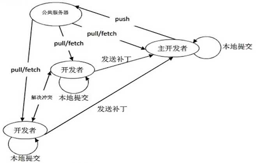

# 4.1.1 团队构建及项目管理

## 项目概览

Swiper Social 是一个类似于 “探探” 的社交类程序, 采用前后端分离结构, 主要包含以下模块：

1. 个人模块
2. 社交模块
3. VIP 模块
4. 异步任务模块
5. Redis 缓存模块
6. 日志模块、异常处理模块
7. 短信模块、邮件模块
8. 运维、部署、shell 脚本
9. 前端模块
10. 其他


## 项目目标

1. 了解真实项目的开发流程
2. 掌握如何使用 Git 完成协作开发和代码管理
3. 掌握 RESTful 的概念, 掌握前后端分离式的开发
4. 掌握日志的使用
5. 掌握缓存的使用
6. 掌握 Redis 不同数据类型的用法
7. 掌握 Celery 异步任务处理
8. 掌握 Nginx 的配置, 及负载均衡的原理
9. 了解分布式数据库及数据分片
10. 掌握数据库关系建模, 及不使用外键如何构建关系
11. 掌握服务器异常处理, 及报警处理
12. 熟练掌握常用 Linux 命令, 以及初级 bash 脚本的开发
13. 掌握线上服务器的安装、部署
14. 理解进程、线程、协程的原理, 以及多路复用、事件驱动、异步非阻塞等概念
15. 对服务器架构、服务高可用等有一个初步认识


## 企业中的团队建制

- 管理层

  - 高层：CEO、COO、CTO 等
  - 中层：各部门总监、经理
  - 基层：主程、Leader

- 人力部门

  - 制定用人制度, 负责人员的流入流出
  - 制定绩效考核制度, 审批薪酬表
  - **每个求职者都要经过人力面试**

- 行政部门

  - 日常办公、卫生管理, 会议、活动管理
  - 内部物品、设备的预算和购置

- 财务部门

  - 资产管理、预算及成本管理、风险管控
  - 薪酬管理, 税务、财报管理

- 市场部门 / 运营部门

- 研发部门

  - 项目经理
  - 产品研发
    - 产品人员
    - 设计人员
  - 技术研发
    - 技术总监
    - 前端开发
      - HTML5 (3~4人)
      - iOS (3~4人)
      - Android (3~4人)
    - 后端开发
      - Python / PHP / Java / Go (4~8人)
      - 运维
      - DBA
    - 测试
      - 白盒测试
      - 黑盒测试 (1~2)


## 工作中的开发流程

1. 产品人员进行原型设计, 提出开发需求
2. 产品需求讨论会
3. 设计人员进行 UI、原画等绘制工作
4. 前端人员接收各种图形元素
5. 前后端人员对接接口, 并编写接口文档
6. 前后端同时开始开发
7. 前后端联合调试
8. 测试人员测试
9. 上线部署、服务重启
10. 新版本发布上线


## 项目阶段开发流程及要求

1. 两人一组, 结组编程, 每组不要超过三人
2. 每组选一人作为组长, 由组长在 Github 上创建自己的组和项目
3. 组长分配任务, 各自开发自己的功能
4. 开发过程中注意编码规范, 力求做到 "团队代码如同一人编写"
5. 每个人为接到的功能创建一个独立的分支
6. 开发、提交、审核、合并、上线


## Git 命令回顾



- **`init`**: 在本地创建一个新的库
- **`clone`**: 从服务器克隆代码到本地 (将所有代码下载)
- **`status`**: 查看当前代码库的状态
- **`add`**: 将本地文件添加到暂存区
- **`commit`**: 将代码提交到本地仓库
- **`push`**: 将本地代码推送到远程仓库
- **`pull`**: 将远程仓库的代码拉取到本地 (只更新与本地不一样的代码)
- **`branch`**: 分支管理
- **`checkout`**: 切换分支 / 代码回滚 / 代码还原
- **`merge`**: 合并分支
- **`log`**: 查看提交历史
- **`diff`**: 差异对比
- **`remote`**: 远程库管理
- **`.gitignore`**: 一个特殊文件, 用来记录需要忽略哪些文件
- ssh-key 的使用


## Github Flow

1. 版本控制及代码管理

   - 分支类型

     - master: 主干分支, 代码经过严格测试, 最稳定, 可以随时上线
     - develop: 开发分支, 合并了各个开发者最新完成的功能, 经过了初步测试, 没有明显 BUG
     - feature: 功能分支, 开发中的状态, 代码最不稳定, 开发完成后需要合并到 develop 分支

   - Pull Request: 拉去请求

     - 开发者自己提交 Pull Request 通知团队成员来合并自己提交的代码。
     - 通过此方式可以将合并过程暴露给团队成员, 让代码在合并之前可以被团队其他成员审核, 保证代码质量。

   - Code Review: 代码审核
     - 代码逻辑问题
     - 算法问题
     - 错误的使用方式
     - 代码风格及规范化问题
     - **学习其他人的优秀代码**

2. 上线流程介绍

   ```
                                                 生产环境服务器
                                                      ^
                                                      | 自动化部署
                                                      |   1. 代码发布上线
           0.1   1.0     2.0            3.0       3.2 |   2. 服务自动重启
   master  *------*-------*--------------*------------*------------->
           |                                          ^ 2. 合并
            \                                         | 1. 发布到测试服
   develop   *---------------------------*----*-------*------------->
             |\                          ^ \          ^
             | \                         |  \         |
             |  V                        |   V        |
   A: user   |   *------*-----------*----|---*------->*
             |                           | 4. 合并 (Merge)
              \                          | 3. 团队成员进行 “Code Review”
               V                         | 2. 发起 “Pull Request”
   B: post     *---*---*---*-----*------>* 1. 开发者 B 在自己本地完成测试
   ```


## 大型项目代码布局

1. 概览

   ```
   proj/
   ├── proj/
   │   ├── settings.py
   │   ├── other_config.py  # 其他配置
   │   ├── urls.py
   │   └── wsgi.py
   ├── common/              # 不与具体模块关联的独立的东西写到这里
   │   ├── errors.py
   │   ├── keys.py
   │   └── middleware.py
   ├── app1/
   │   ├── migrations/
   │   ├── apps.py
   │   ├── helper.py (logic.py)  # 逻辑写到这里
   │   ├── models.py
   │   └── views.py (api.py)
   ├── app2/
   │   ├── migrations/
   │   ├── apps.py
   │   ├── helper.py
   │   ├── models.py
   │   └── views.py (api.py)
   ├── lib/                 # 底层模块写到这里
   │   ├── cache.py
   │   ├── http.py
   │   ├── orm.py
   │   └── sms.py
   ├── worker/              # 异步任务，或耗时任务，或定时任务
   │   ├── __init__.py
   │   └── config.py
   └── manage.py
   ```

2. 布局详解

   - 通用的算法、功能放到 common 目录
   - 底层的功能放到 lib 目录
   - 独立脚本的放到 scripts 目录
   - 配置文件放到项目目录 或 config 目录
   - views.py 及 view_func()
     1. MVC 模式的 V 只负责试图处理, 逻辑属于 Controller 层
     2. view_func 本身不适合写逻辑, view 是特殊函数, 只负责视图处理。
     3. 添加 helper.py 文件, 用来放置每个 app 的逻辑函数
     4. 函数构建应保持功能单一, 一个函数只做一件事情, 并把它做好, 避免构建复杂函数
     5. 复杂功能通过不同函数组合完成


## 项目初始化

```bash
$ mkdir demo
$ cd demo
$ cat > .gitignore << EOF
*.pyc
*.sqlite3
.idea
__pycache__
*.log
.venv
medias/*
EOF
$ python -m venv .venv
$ source .venv/bin/activate
$ pip install ipython django==1.11.7 redis django-redis gevent gunicorn requests celery
$ pip freeze > requirements.txt
$ django-admin startproject demo ./
$ git init
$ git add ./
$ git commit -m 'first commit'
$ git remote add origin git@github.com:yourname/demo.git
$ git push -u origin master
```
