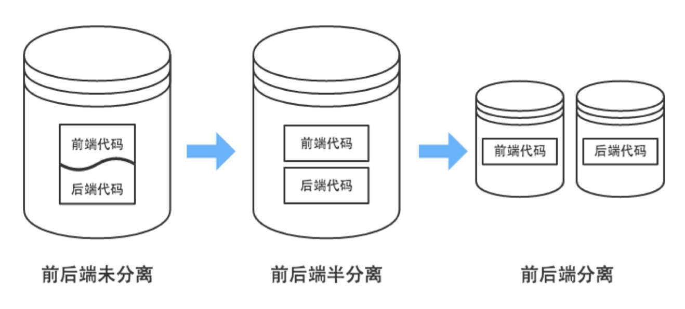
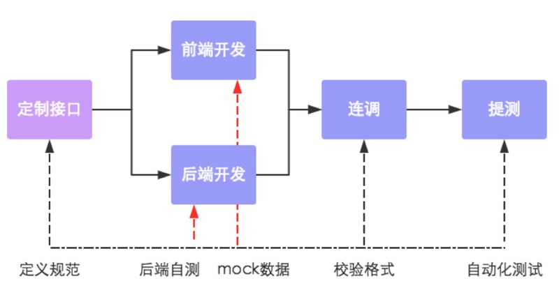

# 4.1.2 User 功能开发

## "用户中心" 模块功能概览

- 获取短信验证码
- 通过验证码登录、注册
- 获取个人资料
- 修改个人资料
- 头像上传


## User 模型及接口规划

1. User 模型设计 (**仅作参考**)

   | Field       | Description |
   | ----------- | ----------- |
   | phonenum    | 手机号      |
   | nickname    | 昵称        |
   | sex         | 性别        |
   | birth_year  | 出生年      |
   | birth_month | 出生月      |
   | birth_day   | 出生日      |
   | avatar      | 个人形象    |
   | location    | 常居地      |

2. 接口规划

   - 接口1: 提交手机号，发送短信验证码
   - 接口2: 提交验证码，登录注册


## 开发中的难点

1. 如何向前端返回 json 数据
2. 短信发送如何处理
3. 验证码如何处理
    - 验证码需随机产生，登录注册验证码一般为 4~6 位随机数
    - 第一个接口获取到的验证码在登录接口还需要使用，需如何保存
    - 每个验证码都有有效期，应如何处理


## RESTful 与前后端分离

1. RESTful

    - RESTful 是一种网络软件架构风格, 而非标准
    - 用 URL 定位一个网络资源
    - 用 HTTP 动词描述对资源的操作
        - GET: 用来获取资源
        - POST: 用来新建资源
        - PUT: 用来更新资源
        - DELETE: 用来删除资源
    - 误区
        - URL 中使用动词
        - URL 中出现版本号
        - 参数用 querystring 表示, 而不要拼在 path 部分
            - 错误示范: GET /user/book/id/3
            - 正确示范: GET /user/book?id=3
        - 状态码的使用要精确
            - 2xx：操作成功
            - 3xx：重定向
            - 4xx：客户端错误
            - 5xx：服务器错误
    - RESTful 与 Django REST framework 的区别

2. 前后端分离

    

    传统 Web 开发, view 函数中需要进行模版渲染, 逻辑处理与显示的样式均需要后端开发.

    变成前后端分离后, 显示效果的处理完全交给前端来做, 前端自由度变大. 后端只需要传递前端需要的数据即可, 将后端人员从繁琐的显示处理中解放出来, 专心处理业务逻辑

    - 优点: 前端负责显示, 后端负责逻辑, 分工更加明确, 彻底解放前、后端开发者
    - JSON: 完全独立于编程语言的文本格式, 用来存储和表示数据
    - 前后端分离后的开发流程

      

3. 代码实现

    ```python
    from json import dumps

    from django.http import HttpResponse

    def render_json(data=None, error_code=0):
        '''将返回值渲染为 JSON 数据'''
        result = {
            'data': data,       # 返回给前端的数据
            'code': error_code  # 状态码 (status code)
        }

        json_str = dumps(result, ensure_ascii=False, separators=[',', ':'])
        return HttpResponse(json_str)
    ```

4. 接口的定义

    1. 定义接口基本格式

       ```json
       {
           "code": 0,   // 错误码 (status code)
           "data": {    // 接口数据
               "user": {
                   "uid": 123321,
                   "username": "Lion",
                   "age": 21,
                   "sex": "Male"
                },
               "date": "2018-09-12",
           }
       }
       ```

    2. 定义 status 状态码

        | code | description    |
        | ---- | -------------- |
        | 0    | 正常           |
        | 1000 | 服务器内部错误 |
        | 1001 | 参数错误       |
        | 1002 | 数据错误       |

    3. 详细定义每一个接口的各个部分:
        - 名称 (Name)
        - 描述 (Description)
        - 方法 (Method)
        - 路径 (Path)
        - 参数 (Params)
        - 返回值 (Returns)

    4. 接口定义举例：

        > **接口名称：提交验证码登录**
        >
        > * **Description**: 根据上一步的结果提交需要的数据
        > * **Method**: POST
        > * **Path**: /user/login
        > * **Params**:
        >
        >    field | required | type | description
        >    ------|----------|------|-----------------------
        >    phone | Yes      |  int | 手机号
        >     code | Yes      |  int | 验证码
        >
        > * **Return**:
        >
        >    field     | required | type | description
        >    ----------|----------|------|-----------------------
        >     uid      |    Yes   | int  | 用户 id
        >     nickname |    Yes   | str  | 用户名
        >     age      |    Yes   | int  | 年龄
        >     sex      |    Yes   | str  | 性别
        >     location |    Yes   | str  | 常居地
        >     avatars  |    Yes   | list | 头像 URL 列表, 最多为 6 张
        >
        >    示例:
        >    ```json
        >    {
        >        "code": 0,
        >        "data": {
        >            "uid": 123,                             // 用户 id
        >            "nickname": "Miao",                     // 用户名
        >            "age": 21,                              // 年龄
        >            "sex": "M",                             // 性别
        >            "location": "China/Beijing",            // 常居地
        >            "avatars": "http://xxx.com/icon/1.jpg"  // 头像
        >        },
        >    }
        >    ```


## 第三方短信平台的接入

1. 短信验证整体流程:
    1. 用户调用应用服务器 "获取验证码接口" (点击 "获取验证码" 按钮时触发)
    2. 应用服务器调用短信平台接口, 将用户手机号和验证码发送到短信平台
    3. 短信平台向用户发送短信
    4. 用户调用 "提交验证码接口"，向应用服务器进行验证
    5. 验证通过，登录、注册……

2. 可选短信平台
    - 阿里云: <https://www.aliyun.com/product/sms>
    - 腾讯云: <https://cloud.tencent.com/document/product/382>
    - 网易云: <https://netease.im/sms>
    - 云之讯: <https://www.ucpaas.com/>
    - 互亿无线: <http://www.ihuyi.com/>

3. 注册账号后, 将平台分配的 APP_ID 和 APP_SECRET 添加到配置中
    - APP_ID: 平台分配的 ID
    - APP_SECRET: 与平台交互时, 用来做安全验证的一段加密用的文本, **不能泄漏给其他人**

4. 注册平台的短信模版

5. 按照平台接口文档开发接口
   - 短信平台的接口通常是 HTTP 或 HTTPS 协议, 接入的时候只需按照接口格式发送 HTTP 请求即可
   - 接口的返回值一般为 json 格式，收到返回结果后需要解析


## Django 中的缓存

1. 接口及用法

    ```python
    from django.core.cache import cache

    # 在缓存中设置 age = 123, 10秒过期
    cache.set('age', 123, 10)

    # 获取 age
    a = cache.get('age')
    print(a)

    # 自增
    x = cache.incr('age')
    print(x)
    ```

2. 使用 Redis 做缓存后端
    - 安装 `pip install django-redis`
    - settings 配置

        ```python
        CACHES = {
            "default": {
                "BACKEND": "django_redis.cache.RedisCache",
                "LOCATION": "redis://127.0.0.1:6379/0",
                "OPTIONS": {
                    "CLIENT_CLASS": "django_redis.client.DefaultClient",
                    "PICKLE_VERSION": -1,
                }
            }
        }
        ```

3. 利用过期时间可以处理一些定时失效的临时数据, 比如手机验证码


## Cookie、 Session 机制剖析

1. 产生过程

    1. 浏览器: 向服务器发送请求
    2. 服务器: 接受并创建 session 对象 (该对象包含一个 session_id)
    3. 服务器: 执行 views 函数, 并得到一个 response 对象
    4. 服务器: 执行 response.set_cookie('sessionid', session_id) 将 session_id 写入 cookie
    5. 服务器: 将 response 传回浏览器
    6. 浏览器: 读取 response 报文, 从 Cookies 取出 session_id 并保存

2. 后续请求

    1. 浏览器: 向服务器发送请求, session_id 随 Cookies 一同发给 Server
    2. 服务器: 从 Headers 的 Cookies 中取出 session_id
    3. 服务器: 根据 session_id 找出对应的数据, 确认客户端身份

3. Django 中的代码实现

    ```python
    class SessionMiddleware(MiddlewareMixin):
        def __init__(self, get_response=None):
            self.get_response = get_response
            engine = import_module(settings.SESSION_ENGINE)
            self.SessionStore = engine.SessionStore  # 设置 Session 存储类

        def process_request(self, request):
            # 从 Cookie 获取 sessionid
            session_key = request.COOKIES.get('session_id')

            # 通过 session_key 获取之前保存的数据
            request.session = self.SessionStore(session_key)

        def process_response(self, request, response):
            try:
                # View 函数结束后, 获取 session 状态
                accessed = request.session.accessed
                modified = request.session.modified
                empty = request.session.is_empty()
            except AttributeError:
                pass
            else:
                # 如果 Cookie 中有 sessionid, 但 session 为空,
                # 说明 view 中执行过 session.flush 等操作,
                # 直接删除 Cookie 中的 session
                if 'session_id' in request.COOKIES and empty:
                    response.delete_cookie(
                        settings.SESSION_COOKIE_NAME,
                        path=settings.SESSION_COOKIE_PATH,
                        domain=settings.SESSION_COOKIE_DOMAIN,
                    )
                else:
                    if accessed:
                        patch_vary_headers(response, ('Cookie',))
                    if (modified or settings.SESSION_SAVE_EVERY_REQUEST) and not empty:
                        # 设置过期时间
                        if request.session.get_expire_at_browser_close():
                            max_age = None
                            expires = None
                        else:
                            max_age = request.session.get_expiry_age()
                            expires_time = time.time() + max_age
                            expires = cookie_date(expires_time)

                        # 保存会话数据, 并刷新客户端 Cookie
                        if response.status_code != 500:
                            try:
                                request.session.save()
                            except UpdateError:
                                raise SuspiciousOperation(
                                    "The request's session was deleted before the "
                                    "request completed. The user may have logged "
                                    "out in a concurrent request, for example."
                                )

                            # 让客户端将 sessionid 添加到 Cookie 中
                            response.set_cookie(
                                'session_id',
                                request.session.session_key,
                                max_age=max_age,
                                expires=expires,
                                domain=settings.SESSION_COOKIE_DOMAIN,
                                path=settings.SESSION_COOKIE_PATH,
                                secure=settings.SESSION_COOKIE_SECURE or None,
                                httponly=settings.SESSION_COOKIE_HTTPONLY or None,
                            )
            return response
    ```


## 作业：登录验证中间件

大多数接口都需要登陆后才可使用，可以通过中间件的方式统一验证。

要点:

1. 统一验证所有接口的登录情况，如果没有登录给出一些提示
2. 需要将不需要验证的特殊接口排除在外
