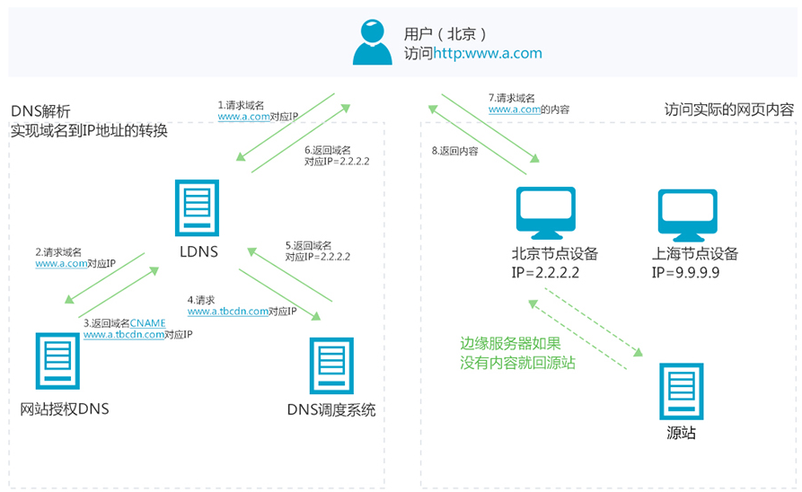

# 4.1.3 个人资料功能开发

## 个人资料接口规划

1. 获取个人资料接口
2. 修改个人资料接口
3. 上传个人头像接口


## Profile 模型设计 (仅作参考)

| Field          | Description              |
| -------------- | ------------------------ |
| location       | 目标城市                 |
| min_distance   | 最小查找范围             |
| max_distance   | 最大查找范围             |
| min_dating_age | 最小交友年龄             |
| max_dating_age | 最大交友年龄             |
| dating_sex     | 匹配的性别               |
| vibration      | 开启震动                 |
| only_matche    | 不让为匹配的人看我的相册 |
| auto_play      | 自动播放视频             |


## 开发中的难点

1. Profile 与 User 两个模型是什么关系 ？
2. 企业中不使用外键如何构建 "表关联" ？
3. 接口中有太多字段批量提交时应如何验证 ？
4. 如何上传头像 ？<https://docs.djangoproject.com/zh-hans/2.0/topics/http/file-uploads/>
5. 大型项目中如何保存大量的静态文件 ？
6. 上传文件、发送验证码、图像处理等较慢操作应如何处理才能让用户等待时间更短 ？


## 数据库表关系的构建

1. 关系分类
    - 一对一关系
    - 一对多关系
    - 多对多关系

2. 外键的优缺点
    - 优点:
        - 由数据库自身保证数据一致性和完整性, 数据更可靠
        - 可以增加 ER 图的可读性
        - 外键可节省开发量
    - 缺点:
        - 性能缺陷, 有额外开销
        - 主键表被锁定时, 会引发外键对应的表也被锁
        - 删除主键表的数据时, 需先删除外键表的数据
        - 修改外键表字段时, 需重建外键约束
        - 不能用于分布式环境
        - 不容易做到数据解耦

3. 应用场景
    - 适用场景: 内部系统、传统企业级应用可以使用 (需要数据量可控, 数据库服务器数量可控)
    - 不适用场景: 互联网行业不建议使用

4. 手动构建关联
    1. 一对多: 主表 id 与 子表 id 完全一一对应
    2. 一对多: 在 "多" 的表内添加 "唯一" 表 id 字段
    3. 多对多: 创建关系表, 关系表中一般只存放两个相关联的条目的 id
    4. 博客案例思考
        1. 用户和文字的关系
        2. 用户和收藏关系
        3. 用户-角色-权限关系

5. 可通过 `property` 的方式对子表进行关联操作

    - property 用法

        ```python
        class Box:
            def __init__(self):
                self.l = 123
                self.w = 10
                self.h = 80

            @property
            def V(self):
                return self.l * self.w * self.h

        b = Box()
        print(b.V)
        ```

    - 对子表关联操作

        ```python
        class User(models.Model):
            ...
            demo_id = models.IntegerField()
            ...

            @property
            def demo(self):
                if not hasattr(self, '_demo'):
                    self._demo = Demo.objects.get(id=self.demo_id)
                return self._demo

        class Demo(models.Model):
            xxx = models.CharField()
            yyy = models.CharField()

        user = User.objects.get(id=123)
        print(user.demo.xxx)
        print(user.demo.yyy)
        ```

    - 也可以使用 cached_property 对属性值进行缓存

        ```python
        from django.utils.functional import cached_property

        class User(models.Model):
            year = 1990
            month = 10
            day = 29

            @cached_property
            def age(self):
                today = datetime.date.today()
                birth_date = datetime.date(self.year, self.month, self.day)
                times = today - birth_date
                return times.days // 365
        ```


## Django 中的 Form 表单验证

- Django Form 核心功能：数据验证

- 网页中 `<form>` 标签
    - `<form>` 标签的 method 只能是 POST 或 GET
    - method=POST 时，表单数据在请求的 body 部分
    - method=GET 时, 表单数据会出现在 URL 里

- Form 对象的属性和方法
    - `form.is_valid()` : 表单验证
    - `form.has_changed()` : 检查是否有修改
    - `form.clean_<field>()` : 针对某字段进行特殊清洗和验证
    - `form.cleaned_data['fieldname']` : 清洗后的数据存放于这个属性

- Form 的定义和使用

    ```python
    from django import forms

    class TestForm(forms.Form):
        TAGS = (
            ('py', 'python'),
            ('ln', 'linux'),
            ('dj', 'django'),
        )
        fid = forms.IntegerField()
        name = forms.CharField(max_length=10)
        tag = forms.ChoiceField(choices=TAGS)
        date = forms.DateField()

    POST = {'fid': 'bear',
            'name': 'hello-1234567890',
            'tag': 'django',
            'date': '2017/12/17'}
    form = TestForm(POST)
    print(form.is_valid())
    print(form.cleaned_data)  # cleaned_data 属性是 is_valid 函数执行时动态添加的
    print(form.errors)
    ```

- ModelForm 可以通过相应的 Model 创建出 Form

    ```python
    class UserForm(ModelForm):
        class Meta:
            model = User
            fields = ['name', 'birth']
    ```


## 项目中的静态文件处理

1. Nginx

    Nginx 处理静态资源速度非常快, 并且自身还带有缓存.

    但需要注意, 分布式部署的多台 Nginx 服务器上, 静态资源需要互相同步

2. CDN

    

    CDN 的全称是 Content Delivery Network, 即内容分发网络.

    它依靠部署在各地的边缘服务器, 通过中心平台的负载均衡、内容分发、调度等功能模块, 使用户就近获取所需内容, 降低网络拥塞, 提高用户访问响应速度和命中率. CDN 的关键技术主要有内容存储和分发技术.

3. 云存储

    - 常见的云存储有：亚马逊 S3 服务、阿里云的 OSS 、七牛云 等

4. 七牛云接入

    1. 注册七牛云账号

    2. 创建存储空间

    3. 获取相关配置
        - AccessKey
        - SecretKey
        - Bucket_name
        - Bucket_URL

    4. 安装 qiniu SDK：`pip install qiniu`

    5. [根据接口文档进行接口封装](https://developer.qiniu.com/kodo/sdk/1242/python)

    6. 按照需要将上传、下载接口封装成异步任务

    7. 程序处理流程

        1. 用户图片上传服务器
        2. 服务器将图片上传到七牛云
        3. 将七牛云返回的图片 URL 存入数据库


## Celery 及异步任务的处理

1. 模块组成

    

    * 任务模块 Task

        包含异步任务和定时任务. 其中, 异步任务通常在业务逻辑中被触发并发往任务队列, 而定时任务由 Celery Beat 进程周期性地将任务发往任务队列.

    * 消息中间件 Broker

        Broker, 即为任务调度队列, 接收任务生产者发来的消息（即任务）, 将任务存入队列. Celery 本身不提供队列服务, 官方推荐使用 RabbitMQ 和 Redis 等.

    * 任务执行单元 Worker

        Worker 是执行任务的处理单元, 它实时监控消息队列, 获取队列中调度的任务, 并执行它.

    * 任务结果存储 Backend

        Backend 用于存储任务的执行结果, 以供查询. 同消息中间件一样, 存储也可使用 RabbitMQ, Redis 和 MongoDB 等.

2. 安装

    ```
    pip install 'celery[redis]'
    ```

3. 创建实例

    ```python
    import time
    from celery import Celery

    broker = 'redis://127.0.0.1:6379'
    backend = 'redis://127.0.0.1:6379/0'
    app = Celery('my_task', broker=broker, backend=backend)

    @app.task
    def add(x, y):
        time.sleep(5)     # 模拟耗时操作
        return x + y
    ```

4. 启动 Worker

    ```
    celery worker -A tasks --loglevel=info
    ```

5. 调用任务

    ```python
    from tasks import add

    add.delay(2, 8)
    ```

6. 常规配置

    ```python
    broker_url = 'redis://127.0.0.1:6379/0'
    broker_pool_limit = 1000  # Borker 连接池, 默认是10

    timezone = 'Asia/Shanghai'
    accept_content = ['pickle', 'json']

    task_serializer = 'pickle'
    result_expires = 3600  # 任务过期时间

    result_backend = 'redis://127.0.0.1:6379/0'
    result_serializer = 'pickle'
    result_cache_max = 10000  # 任务结果最大缓存数量

    worker_redirect_stdouts_level = 'INFO'
    ```
