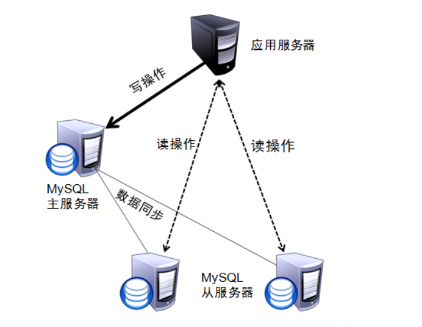
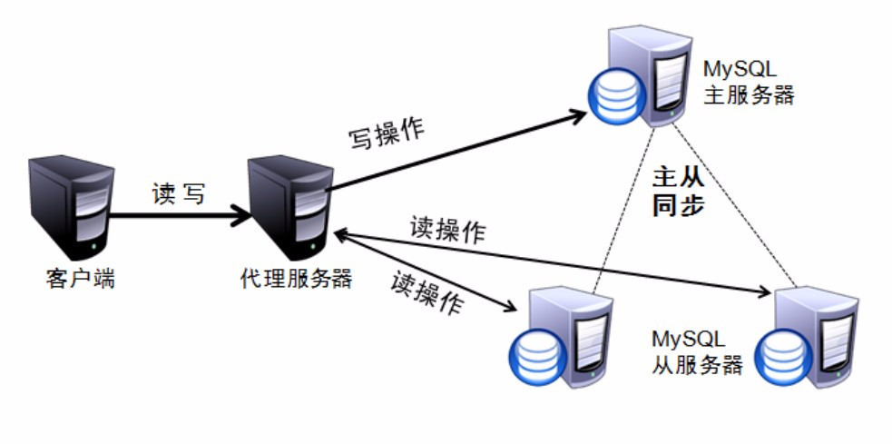
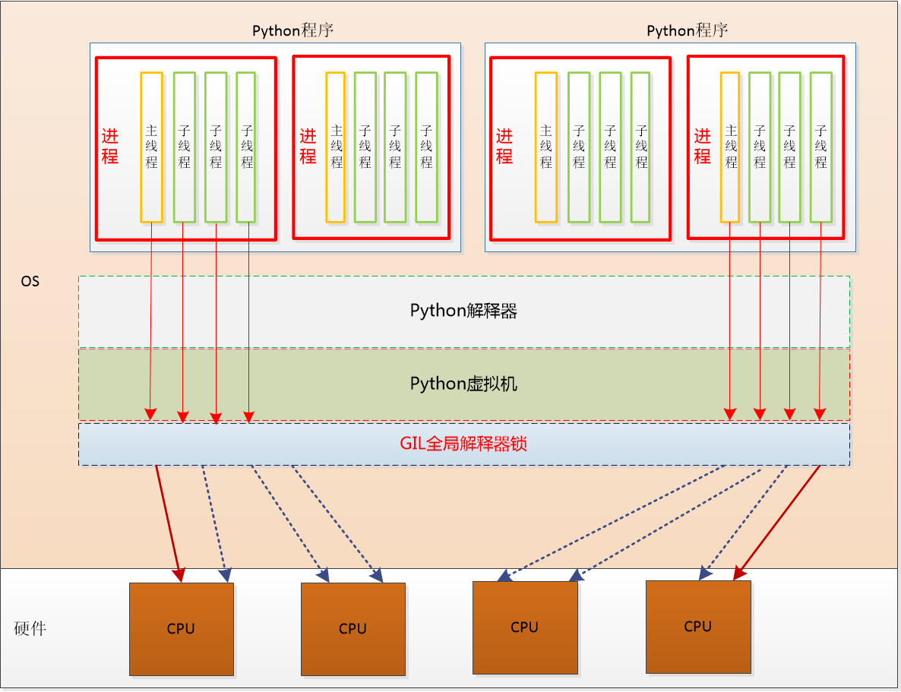

# 分布式存储及 Web 服务器性能评估

## 分布式数据库

数据量不大时，单库单表即可支撑整个系统。当数据量达到一定规模后，则需通过分布式数据库支持。
同时，单点数据库无法保证服务高可用，一旦出现宕机整个服务便 “停摆” 了

常见的分布式数据库实现方式有 “分库” 和 “分表”, 也被称作 “数据分片”

1. 数据分片
    * 单表查询能力上限: 约为 500 万 左右
    * 方式: 分库、分表

2. 垂直拆分

    单表字段太多的时候会进行垂直拆分, 不是为了分布式存储，而是为了提升单表性能

    ```
                                垂直拆分
                                   |
    user                           | ext_info
                                   |
    | id  name  sex  age  location | uid aa  bb  cc  dd  ee  ff |
    | ---------------------------- | -------------------------- |
    | 1   xxx   f    11   beijing  | 1  x   x   x   x   x   x   |
    | 2   xxx   f    11   beijing  | 2  x   x   x   x   x   x   |
    | 3   xxx   f    11   beijing  | 3  x   x   x   x   x   x   |
    | 4   xxx   f    11   beijing  | 4  x   x   x   x   x   x   |
    | 5   xxx   f    11   beijing  | 5  x   x   x   x   x   x   |
    | 6   xxx   f    11   beijing  | 6  x   x   x   x   x   x   |
    | 7   xxx   f    11   beijing  | 7  x   x   x   x   x   x   |
    | 8   xxx   f    11   beijing  | 8  x   x   x   x   x   x   |
    | 9   xxx   f    11   beijing  | 9  x   x   x   x   x   x   |
    ```

3. 水平拆分

    水平拆分既可以用在 “分表” 处理，也可用在 “分库” 处理

    ```
    user
    id  name  sex  age  location  aa  bb  cc  dd  ee  ff
    ------------------------------------------------------ user_1
    1   xxx   f    11   beijing   x   x   x   x   x   x
    2   xxx   f    11   beijing   x   x   x   x   x   x
    3   xxx   f    11   beijing   x   x   x   x   x   x
    ------------------------------------------------------ user_2
    4   xxx   f    11   beijing   x   x   x   x   x   x
    5   xxx   f    11   beijing   x   x   x   x   x   x
    6   xxx   f    11   beijing   x   x   x   x   x   x
    ------------------------------------------------------ user_3
    7   xxx   f    11   beijing   x   x   x   x   x   x
    8   xxx   f    11   beijing   x   x   x   x   x   x
    9   xxx   f    11   beijing   x   x   x   x   x   x
    ```

    * 按范围拆分
        * 优点: 构建简单, 扩容极其方便.
        * 缺点: 不能随运营发展均衡分配资源
        * 示例

            ```
            Database-1       1 -  500W   <- uid: 3120482
            Database-2    500W - 1000W
            Database-3   1000W - 1500W   <- post_id: 20278327
            Database-4   1500W - 2000W
            ```

    * 按余数拆分
        * 优点: 能够随着运营发展均匀分配负载
        * 缺点: 扩容不方便, 前期投入大
        * 示例

            ```
            uid = 3120483
            mod = uid % len(Databases) -> 3
            db_name = 'Database-3'

            Database-0      10  20  30   ...  3120480
            Database-1   1  11  21  31   ...  3120481
            Database-2   2  12  22  32   ...  3120482
            Database-3   3  13  23  33   ...  3120483
            Database-4   4  14  24  34   ...  3120484
            Database-5   5  15  25  35   ...  3120485
            Database-6   6  16  26  36   ...  3120486
            Database-7   7  17  27  37   ...  3120487
            Database-8   8  18  28  38   ...  3120488
            Database-9   9  19  29  39   ...  3120489
            ```

4. 分布式数据库的 ID
    - 必须保证全服多机上产生的 ID 唯一
    - 常见全局唯一 ID 生成策略
        1. 基于存储的自增 ID
            - 可在 Redis 中为每一个表记录当前最新 ID 是多少, 获取下一个 ID 时进行自增
            - 优点: 思路简单, ID 连续
            - 缺点: 有存储依赖, 一旦 Redis 出现问题, 则会影响全部数据库存储
        2. 基于算法确保唯一
            - 常见算法有 UUID、COMB、Snowflake、ObjectID 等
            - 优点: 快速、无存储依赖
            - 缺点: 一般产生的 ID 数值都比较大, 某些算法的 ID 并非是增序

## 数据库集群

* 通过增加冗余的数据库服务器可构建数据库集群
* 同一集群中的多台数据库保存的数据必须完全一致
* 集群中一台服务器宕机，其他服务器可以继续提供服务
* 常见结构：一主多从，主从之间通过 binlog 进行数据同步
* 读写分离
    * 主机用来做数据写入；从机用来数据读取
    * 程序自身实现读写分离

        

    * 使用第三方代理实现读写分离

        

## 服务高可用

1. 对软硬件的冗余, 以消除单点故障. 任何系统都会有一个或多个冗余系统做备份
2. 对故障的检测和恢复. 检测故障以及用备份的结点接管故障点, 也就是 “故障转移”
3. 需要很可靠的交汇点 (CrossOver). 这是一些不容易冗余的结点, 比如域名解析, 负载均衡器等.


## 并发与性能

* 概念
    * 理解 I/O 的概念
    * 理解 “同步/异步”、“阻塞/非阻塞”
    * 了解 “事件驱动” 和 “多路复用”
    * 异步模型并不会消灭阻塞，而是在发生 I/O 阻塞时切换到其他任务，从而达到异步非阻塞

* 计算密集型
    * CPU 长时间满负荷运行, 如图像处理、大数据运算、科学运算等
    * 计算密集型: 用 C 语言或 Cython 补充

* I/O 密集型
    * 网络 IO, 文件 IO, 设备 IO 等
    * Unix: 一切皆文件

* 多任务处理
    * 进程、线程、协程调度的过程叫做上下文切换
    * 进程、线程、协程对比

     名称 | 资源占用 |           数据通信            | 上下文切换 (Context)
    -----|---------|------------------------------|------------------
     进程 |    大   | 不方便 (网络、共享内存、管道等) | 操作系统按时间片切换, 不够灵活, 慢
     线程 |    小   |           非常方便            | 按时间片切换, 不够灵活, 快
     协程 |  非常小 |           非常方便            | 根据I/O事件切换, 更加有效的利用 CPU

* 全局解释器锁 ( GIL )

    

    * 它确保任何时候一个进程中都只有一个 Python 线程能进入 CPU 执行。
    * 全局解释器锁造成单个进程无法使用多个 CPU 核心
    * 通过多进程来利用多个 CPU 核心，一般进程数与CPU核心数相等，或者CPU核心数两倍

* 协程

    - Python 下协程的发展:
        - stackless / greenlet / gevent
        - tornado 通过纯 Python 代码实现了协程处理 (底层使用 yield)
        - asyncio: Python 官方实现的协程

    - asyncio 实现协程

        ```python
        import asyncio

        async def foo(n):
            for i in range(10):
                print('wait %s s' % n)
                await asyncio.sleep(n)
            return i

        task1 = foo(1)
        task2 = foo(1.5)
        tasks = [asyncio.ensure_future(task1),
                asyncio.ensure_future(task2)]

        loop = asyncio.get_event_loop()  # 事件循环，协程调度器
        loop.run_until_complete( asyncio.wait(tasks) )
        ```

* 结论：通常使用多进程 + 多协程达到最大并发性能
    * 因为 GIL 的原因, Python 需要通过多进程来利用多个核心
    * 线程切换效率低, 而且应对 I/O 不够灵活
    * 协程更轻量级，完全没有协程切换的消耗，而且可以由程序自身统一调度和切换
    * HTTP Server 中，每一个请求都由独立的协程来处理

* 单台服务器最大连接数
    * 文件描述符: 限制文件打开数量 (一切皆文件)
    * 内核限制: `net.core.somaxconn`
    * 内存限制
    * 修改文件描述符: `ulimit -n 65535`

* 使用 Gunicorn 驱动 Django
    * <http://docs.gunicorn.org/en/latest/install.html>
    * Gunicorn 扮演 HTTPServer 的角色
    * HTTPServer: 只负责网络连接 (TCP握手、数据收/发)

* 分清几个概念
    * WSGI:
        全称是 WebServerGatewayInterface, 它是 Python 官方定义的一种描述 HTTP 服务器 (如nginx)与 Web 应用程序 (如 Django、Flask) 通信的规范。全文定义在 [PEP333](https://www.python.org/dev/peps/pep-0333/)

    * uwsgi:
        与 WSGI 类似, 是 uWSGI 服务器自定义的通信协议, 用于定义传输信息的类型(type of information)。每一个 uwsgi packet 前 4byte 为传输信息类型的描述, 与 WSGI 协议是两种东西, 该协议性能远好于早期的 Fast-CGI 协议。

    * uWSGI:
        uWSGI 是一个全功能的 HTTP 服务器, 实现了WSGI协议、uwsgi 协议、http 协议等。它要做的就是把 HTTP协议转化成语言支持的网络协议。比如把 HTTP 协议转化成 WSGI 协议, 让 Python 可以直接使用。

    ```
    HTTP Server  => 负责 1. 接受、断开客户端请求; 2. 接收、发送网络数据
        ^
        |
        v
      WSGI       => 负责 在 HTTPServer 和 WebApp 之间进行数据转换
        ^
        |
        v
    Web App      => 负责 Web 应用的业务逻辑
    ```


## 压力测试

* 常用工具
    - [ab (apache benchmark)](https://httpd.apache.org/docs/2.4/programs/ab.html)
    - [siege](https://github.com/JoeDog/siege)
    - webbench
    - [wrk](https://github.com/wg/wrk)

* Web 系统性能关键指标: **RPS** (Requests per second)
* 其他:
    * QPS (每秒查询数)
    * TPS (每秒事务数, 数据库指标)

* Ubuntu 下安装 ab: `apt-get install apache2-utils`
* 压测: `ab -k -n 1000 -c 300 http://127.0.0.1:9000/`
