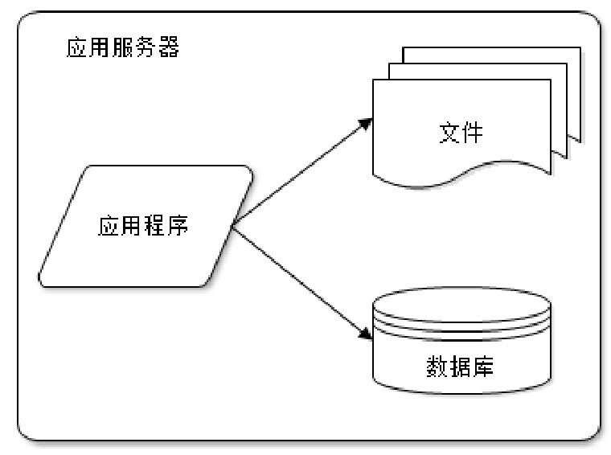
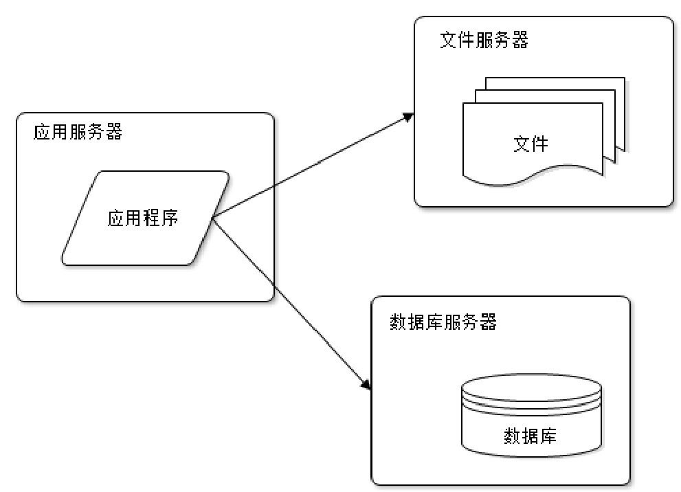
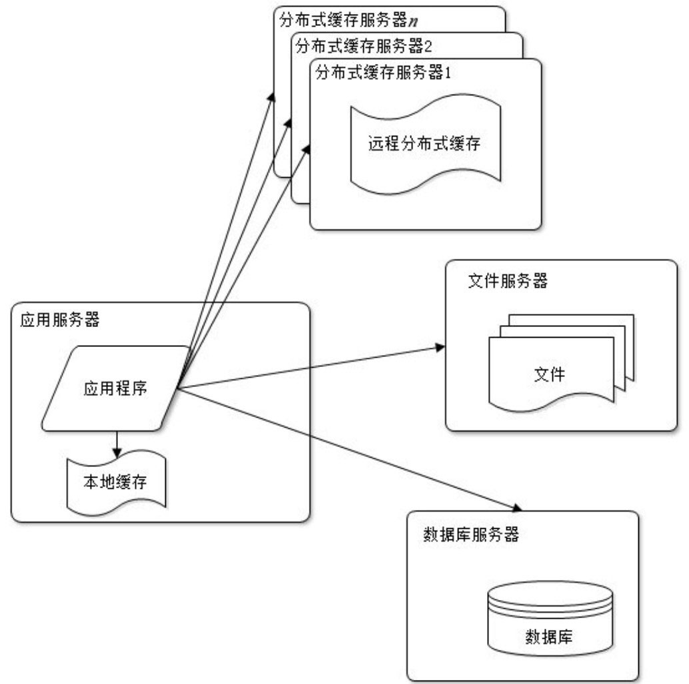
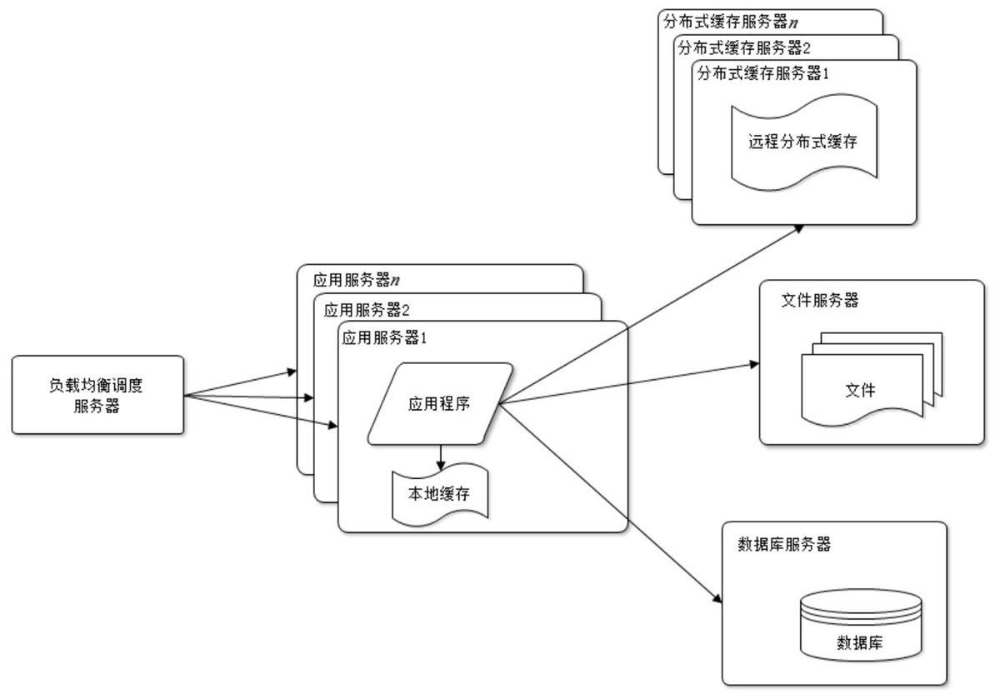
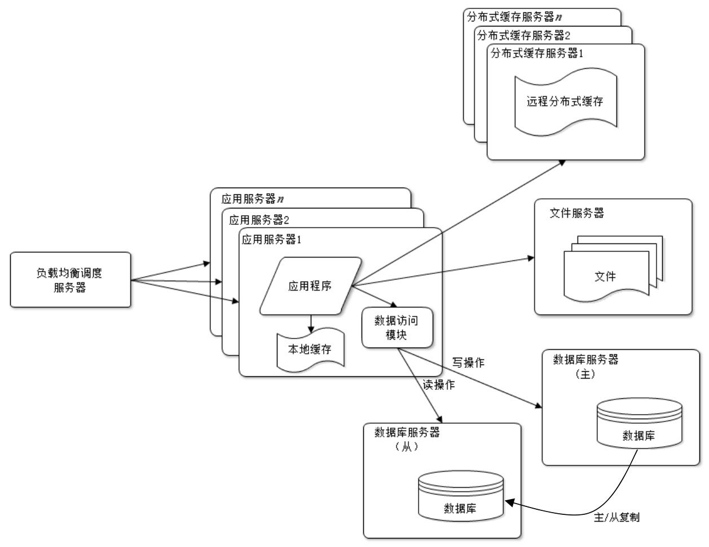
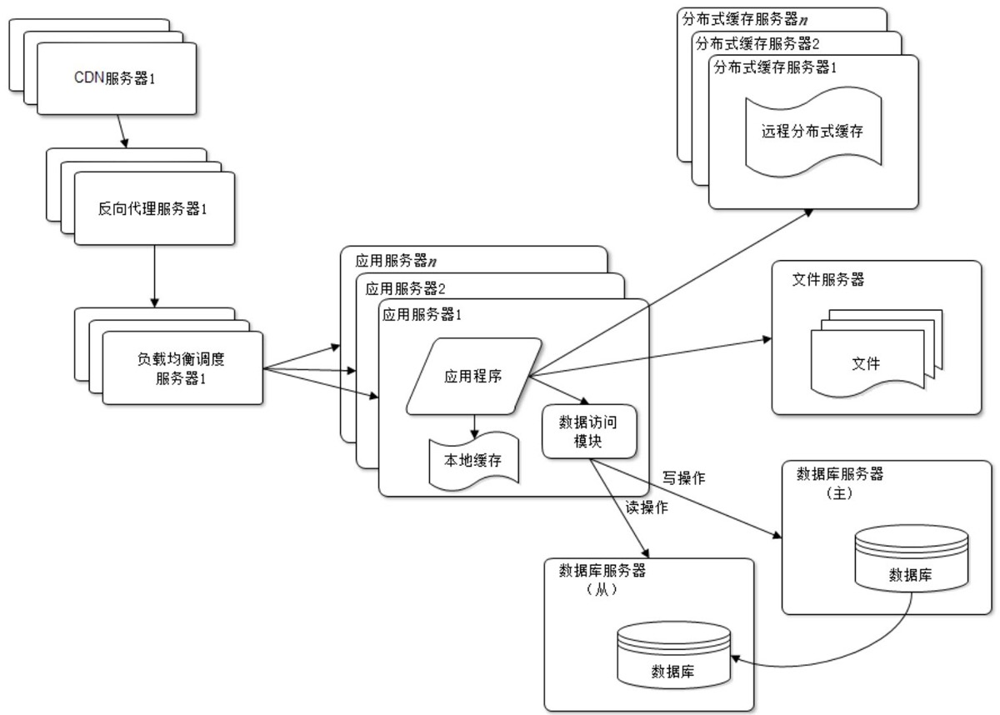
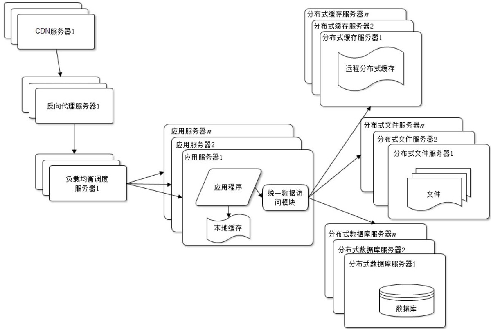
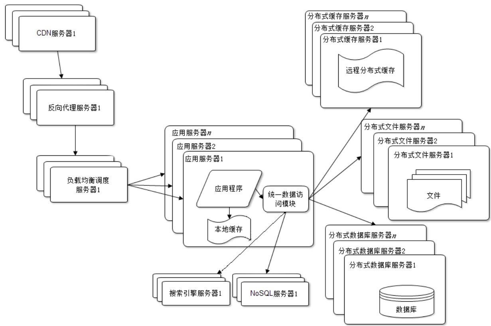
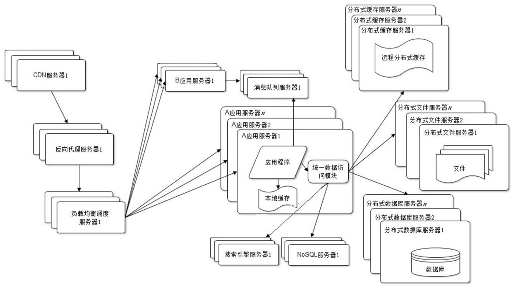
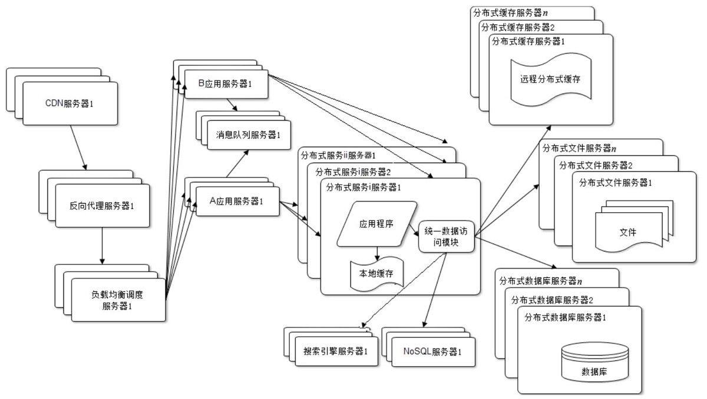

# 反向代理、负载均衡、服务器架构

## Nginx 与负载均衡

* 反向代理

    1. 将用户请求转发给内部服务器，保护内网拓扑结构

        ```
                       / Django-1
        user -> proxy ── Django-2
                       \ Django-3
        ```

    2. 可以解析用户请求，代理静态文件

* 负载均衡
    - 轮询: rr (默认)
    - 权重: weight
    - IP哈希: ip_hash
    - 最小连接数: least_conn

* 其他负载均衡
    * F5: 硬件负载均衡设备, 性能最好, 价格昂贵
    * LVS: 工作在 2层 到 4层 的专业负载均衡软件, 只有 3 种负载均衡方式, 配置简单
    * HAProxy: 工作在 4层 到 7层 的专业负载均衡软件, 支持的负载均衡算法丰富
    * 性能比较: F5 > LVS > HAProxy > Nginx

* LVS 的优势

    - 常规负载均衡

        进出都要经过负载均衡服务器. 响应报文较大, 面对大量请求时负载均衡节点本身可能会成为瓶颈

        ```
        发送请求: User -> LoadBalancer -> Server
        接收响应: User <- LoadBalancer <- Server
        ```

    - LVS DR 模式

        LoadBalancer 与 Server 同在一个网段, 共享同一个公网 IP, 响应报文可以由 Server 直达 User

        ```
        发送请求: User -> LoadBalancer -> Server
        接收响应: User <───────────────── Server
        ```

* 可以不使用 Nginx, 直接用 gunicorn 吗？
    * Nginx 相对于 Gunicorn 来说更安全
    * Nginx 可以用作负载均衡.

* 处理静态文件相关配置

    ```nginx
    location /statics/ {
        root   /project/bbs/;
        expires 30d;
        access_log off;
    }

    location /medias/ {
        root   /project/bbs/;
        expires 30d;
        access_log off;
    }
    ```
<div style="page-break-after: always;"></div>


## 服务器架构

1. 架构研究的 5 个方面
    * 高性能
    * 高可用
    * 可伸缩
    * 可扩展
    * 安全性

2. 简单、实用的服务器架构图

    * 分层结构: 功能模块解耦合
    * 每层多台机器: 有效避免单点故障
    * 每层均可扩容: 能通过简单的方式提升服务器的性能、可用性、扛并发能力

    ```
                   User Request    cli_ip(12.23.34.45) -> ip_hash: 3
                 |    |    |    |
                 V    V    V    V
                 www.example.com                ---> 第一层负载均衡
                     DNS 轮询
                    /       \
                   V         V
               Nginx         Nginx
            115.2.3.11     115.2.3.12           ---> Nginx 绑定公网 IP
           /    |     \   /     |    \
          /     |       X       |     \
         V      V     V   V     V      V
    AppServer  AppServer  AppServer  AppServer  ---> Gunicorn + Django
    10.0.0.1   10.0.0.2   10.0.0.3   10.0.0.4   ---> AppServer 绑定内网 IP
    weight:10  weight:20  weight:20  weight:20  ---> 权重
        |         |          |           |
        V         V          V           V
    +------------------------------------------+
    |           缓存层   主机 <--> 从机          |
    +------------------------------------------+
        |         |          |           |
        V         V          V           V
    +------------------------------------------+
    |           数据库  主机 <--> 从机           |
    +------------------------------------------+
    ```
    <div style="page-break-after: always;"></div>


## 服务器架构的发展

* 早期服务器, 所有服务在一台机器

    

    <div style="page-break-after: always;"></div>

* 服务拆分, 应用、数据、文件等服务分开部署

    

    <div style="page-break-after: always;"></div>

* 利用缓存提升性能

    

    <div style="page-break-after: always;"></div>

* 应用服务器分布式部署, 提升网站并发量和吞吐量

    

    <div style="page-break-after: always;"></div>

* 通过读写分离读写分离提升数据库性能和数据可靠性

    

    <div style="page-break-after: always;"></div>

* 使用反向代理、CDN、云存储等技术提升静态资源访问速度, 并能有效提升不同地域的访问体验

    

    <div style="page-break-after: always;"></div>

* 通过分布式数据库和分布式文件系统满足数据和文件海量存储需求, 并进一步提升数据可靠性

    

    <div style="page-break-after: always;"></div>

* 增加搜索引擎 和 NoSQL

    

    <div style="page-break-after: always;"></div>

* 增加消息队列服务器, 让请求处理异步化

    

    <div style="page-break-after: always;"></div>

* 拆分应用服务器与内部服务

    

    <div style="page-break-after: always;"></div>


## 其他

- 服务器性能预估

    1. 首先需知道网站日活跃 (DAU) 数据
    2. 按每个活跃用户产生 100 个请求计算出 “每日总请求量”

        不同类型的网站请求量差异会很大, 可以自行调整一个用户产生的请求数

        ```
        每日总请求量 = DAU x 单个用户请求量
        ```

    3. 有了总请求量便可计算 “每日峰值流量”, 流量一般单位为 rps (requests per second)

        根据经验可知: 每天 80% 的请求会在 20% 的时间内到达

        由此可知:

        ```
                        每日总请求量 x 80%
        每日峰值流量 = ───────────────────────
                           86400 x 20%
        ```

    4. 一般带负载的 web 服务器吞吐量约为 300rps, 所以:

        ```
        WebServer 数量 = 每日峰值流量 / 300
        ```

    5. 得到 WebServer 数量以后, 再根据用户规模和请求量估算 Nginx、Cache、Database 等服务器的数量

- 真实工作中服务器分配情况
